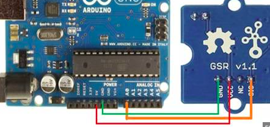

## ESP32 Files.

Here you can find the code for the GSR, Brain, Heartbeat and Respiration sensors.
These codes are designed to work with the ESP32 DEV KIT 1. These codes are designed to comunicate the Esp32 
with the MQTT Server.

### Neuroserial and Neuromqtt.

The Neuroserial program is designed to read the frecquency power spectrum and display it on the serial monitor.
The neuromqtt is designed to publish the frecquency power spectrum in the EEG MQTT topic.

## Conecting Sen0203 to Esp32.

Signal pin is conected to D15 of Esp32 Dev Kit 1 board. 

## Conecting Grove GSR sensor to Esp32.

 In order to be able to use a timmer for sampling the signal but still being able to stream our data through Wifi we 
 need to connect the signal pin of the Grove GSR sensor to pin 33 of the Esp32 Dev Kit 1.
 
 
