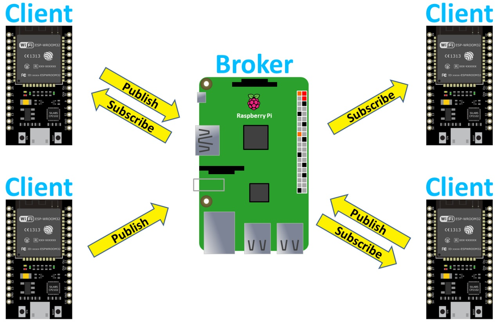
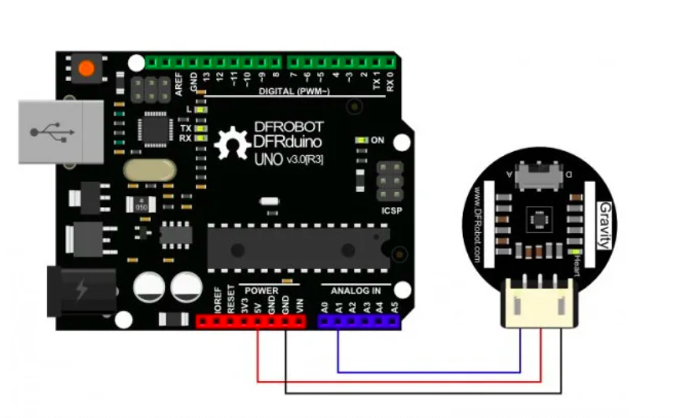

## ESP32 Files

Here you can find the code for the GSR, Brain, Heartbeat and Respiration sensors.
These codes are designed to work with the ESP32 DEV KIT 1. These codes are designed to comunicate the Esp32 
with the MQTT Server.

### Neuroserial and Neuromqtt

The Neuroserial program is designed to read the frecquency power spectrum and display it on the serial monitor.
The neuromqtt is designed to publish the frecquency power spectrum in the EEG MQTT topic.

## Conecting Sen0203 to Esp32

